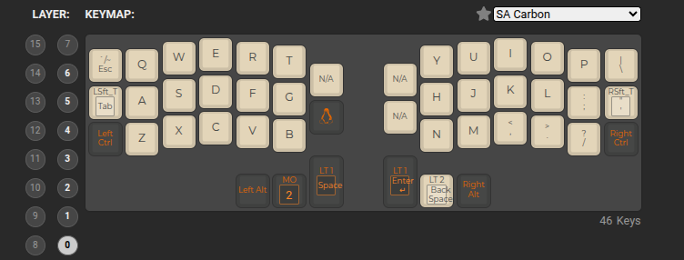
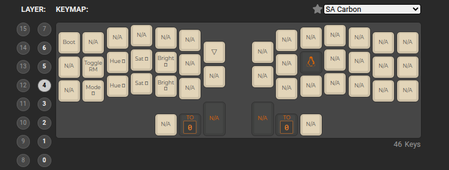

# Раскладка клавиатуры

Много взято из базовой настройки. В частности

Слой с символами почти полностью взят из дефолтной настройки. Так же слой 1 где распаложены цифры и стрелки

# v1.1

Изменения:

- в слое 2 добавлен `"` в нативном месте
    
- в слое 2 добавлен с права shift
- в слое 3 сверху с права добавлен delete

__screenshots__

