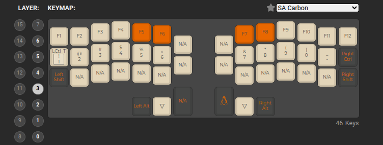
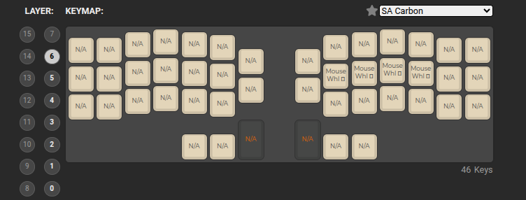

# Раскладка клавиатуры

Много взято из базовой настройки. В частности

Слой с символами почти полностью взят из дефолтной настройки. Так же слой 1 где распаложены цифры и стрелки

# v1.0

__screenshots__

