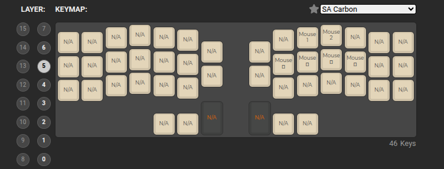

# Раскладка клавиатуры

Много взято из базовой настройки. В частности

Слой с символами почти полностью взят из дефолтной настройки. Так же слой 1 где распаложены цифры и стрелки

# Version 3

Особенность версии 3 цифры в слое 2 адаптированы как для клавиатуры штатной. 
Немного переделано расположение символов.
Из за переноса цифр в других слоях тоже появились изменения.

референс на раскладки
- https://habr.com/ru/articles/566784/
- https://github.com/devpew/zmk-config/tree/master
- https://github.com/senz/zmk-config

__screenshots__

# Ref

тренажеры:
- https://stamina-online.com/ru/lessons/ru
- https://www.typingstudy.com/ru-russian-3/

страница для настройки клавиатуры:

https://config.qmk.fm/#/crkbd/rev4_1/standard/LAYOUT_split_3x6_3_ex2
